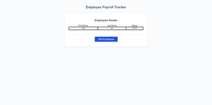

# Employee-Payroll-Tracker

## Description

For this project I had been assigned multipe tast to achieve the final product, which was to display a first and last name
and salary. I had to make specific code to add multiple employees that would
display on the page by creating an array. I also needed to get the average salary by creating a code
that used return and acccumulator. By using these in my code I was able to keep track
of the running total of salarys. The return and acc have to be used together. 
Finally I was asked to generate a random employee. I used the Math fuction to help
generate a random number as well as getRandomEmployee fuction to help
randomly select from the array that I created for this project.

```md

```


## Links
[Live URL]https://github.com/meg-an321/Employee-Payroll-Tracker

[GitHub Repo]https://meg-an321.github.io/Employee-Payroll-Tracker/